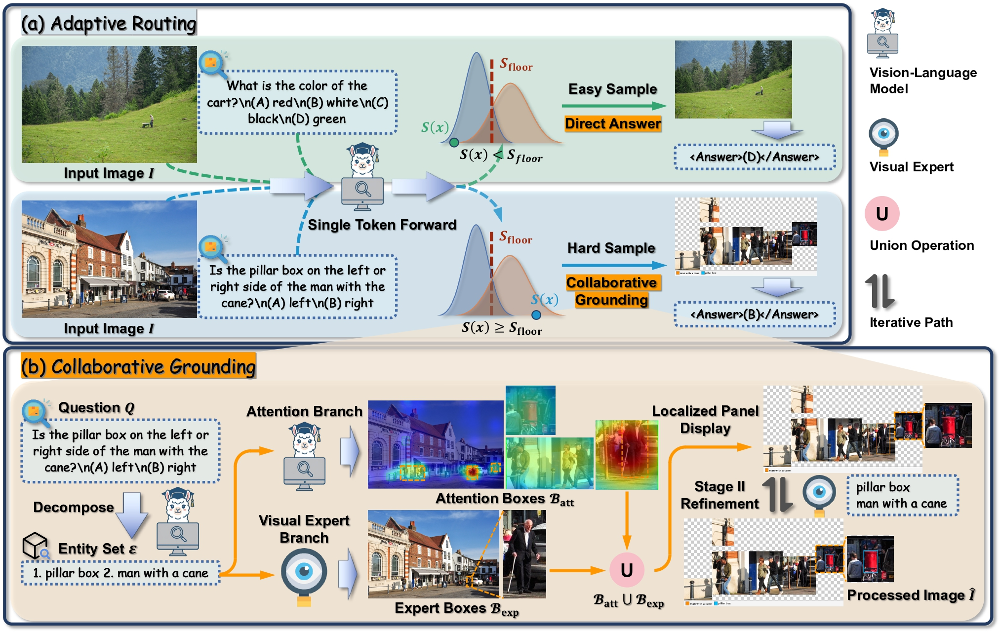

<div align="center">
<h1>Focus When Necessary: Adaptive Routing and Collaborative Grounding for <br>Training-Free Visual Grounding</h1>
</div>

<div align="center">
  <a href='https://tencentbac.github.io/LazyMCoT/'></a>
  <a href='https://arxiv.org/abs/2606.16158'></a>
  <a href='https://huggingface.co/collections/TencentBAC/lazymcot'></a>
  <a href='https://github.com/TencentBAC/LazyMCoT'></a>
</div>

<br>

<p align="center">
  <b>Yifan Wang<sup>1,2</sup>, Peiming Li<sup>1,3</sup>, Shiyu Li<sup>1</sup>, Zhiyuan Hu<sup>1,3</sup>, Xiaochen Yang<sup>4</sup>, <br>Wenming Yang<sup>2,†</sup>, Yang Tang<sup>1,†,‡</sup>, Zheng Wei<sup>1,†</sup></b><br>
  <br>
  <sup>1</sup>Tencent BAC &nbsp;&nbsp; <sup>2</sup>Tsinghua University &nbsp;&nbsp; <sup>3</sup>Peking University &nbsp;&nbsp; <sup>4</sup>University of Glasgow<br>
  <br>
  <sup>†</sup>Corresponding Authors &nbsp;&nbsp; <sup>‡</sup>Project Lead<br>
  <br>
  <i>📧 {wyattyfwang, ethanntang, hemingwei}@tencent.com</i>
  <br>
  <br>
</p>

---

## 📌 Introduction

While Multimodal Large Language Models (MLLMs) excel in cross-modal reasoning, they often struggle to perceive fine-grained details in complex high-resolution images. Recent **training-free** methods address this through image scaling and localized cropping. However, applying these manipulations *indiscriminately* introduces two problems: it is **computationally redundant** for simple queries that the base VLM can already solve, and it is **detrimental** to accuracy because truncating essential global context and introducing irrelevant background noise can flip originally-correct predictions into wrong ones — an effect that is especially pronounced on reasoning-heavy tasks.

We propose **LazyMCoT**, a dynamic and training-free framework that **adaptively allocates visual grounding effort according to sample difficulty**:

- An **Adaptive Router** leverages zero-cost first-token statistics from a single forward pass to gauge predictive uncertainty, instantly bypassing confident cases while guaranteeing a *controllable recall* of difficult ones via conformal calibration.
- For the routed hard samples, a **Collaborative Grounding** module couples the VLM's inherent cross-modal attention with an external visual expert through a two-stage refinement process, producing a precise **Localized Panel Display** that recovers small or occluded targets for re-querying.

Extensive experiments across multiple challenging benchmarks and diverse VLM backbones show that LazyMCoT achieves state-of-the-art performance among training-free methods — and even rivals training-based approaches — while **simultaneously improving reasoning accuracy and reducing average inference latency**.

<div align="center">
  
</div>

## ✨ Key Features

- 🧭 **Adaptive Routing** — A lightweight difficulty-aware router that decides *whether visual grounding is necessary* using only first-token logit statistics (CORE5: `answer_topp`, `answer_margin`, `vocab_full_entropy_norm`, `option_mass`, `logit_gap_opt_nonopt`). The decision rule `run_grace ⟺ s(x) ≥ s_floor` is calibrated by a **conformal** quantile, giving a controllable lower bound on the recall of hard samples — no manual threshold tuning.
- 🔍 **Collaborative Grounding (GRACE)** — Relative-attention normalization (suppresses background noise) + SAM3 text-prompted detection as an independent complementary branch + Otsu/fixed-threshold binarization + a second SAM3 verification stage, fused into a compact **Localized Panel Display (LPD)** for re-querying.
- 🔌 **Training-Free & Plug-and-Play** — Works out of the box on multiple VLM backbones (**Qwen2.5-VL**, **Qwen3-VL**, **InternVL3**) without any fine-tuning.
- ⚡ **Faster *and* More Accurate** — Confident queries skip the heavy grounding pipeline entirely, reducing average latency while preserving (and often improving) accuracy.

## 📦 Requirements

- Python 3.10+
- PyTorch 2.6.0 (install from the [official site](https://pytorch.org/) matching your CUDA version)
- A CUDA-capable GPU (Flash-Attention 2 is used for the Qwen backbones)
- See [`requirements.txt`](requirements.txt) for the full list

## 🛠️ Installation

```bash
git clone https://github.com/TencentBAC/LazyMCoT.git
cd LazyMCoT

# Install PyTorch first (choose the build matching your CUDA), e.g.:
# pip install torch==2.6.0 --index-url https://download.pytorch.org/whl/cu124

pip install -r requirements.txt
```

Download the model checkpoints you intend to use and update the corresponding `model_path` / `path` in the entry scripts (see [Usage](#-usage)):

| Backbone     | Checkpoint                          |
| ------------ | ----------------------------------- |
| Qwen2.5-VL   | `Qwen2.5-VL-7B-Instruct`            |
| Qwen3-VL     | `Qwen3-VL-8B-Instruct`              |
| InternVL3    | `InternVL3-8B-Instruct`             |
| Visual Expert| `SAM3` (`sam3.pt`)                  |

## 📂 Data Preparation

LazyMCoT consumes a JSON dataset where each item provides an image path, a question (multiple-choice), and the answer label. Supported benchmarks include **V\*Bench**, **HR-Bench (4K/8K)** and **TreeBench**.

Set the dataset path in the `__main__` block of the corresponding entry script:

```python
datasetdir = "/path/to/data/benchmark.json"
savejson   = "/path/to/output/results.json"
```

## 🚀 Usage

### 1. Start the Visual Expert Service (SAM3)

The Collaborative Grounding module calls an external visual expert over HTTP. Launch the SAM3 service first:

```bash
cd expert_server
# Edit SAM3_CKPT_PATH in model_service_v2.py to point to your sam3.pt
bash start_server.sh          # serves on http://localhost:8002/predict
```

> `model_service.py` provides an alternative LangSAM (GroundingDINO + SAM2) backend.

### 2. Run Inference + Routing

Each backbone has its own entry script. Edit the paths/switches in the `__main__` block, then run:

```bash
# Qwen3-VL
cd Qwen3 && python cycle_infer.py

# Qwen2.5-VL
cd Qwen2.5 && python cycle_infer.py

# InternVL3
cd Internvl && python cycle_inference_internvl.py
```

Key switches (in `__main__`):

| Variable             | Meaning                                                              |
| -------------------- | ------------------------------------------------------------------- |
| `enable_grace`       | Enable the Collaborative Grounding (GRACE) module                   |
| `enable_router`      | Enable the Adaptive Router (forces `skip_ori=False`)                |
| `router_report_path` | Router config; defaults to `params/<Backbone>/router_report.json`   |
| `router_alpha`       | Override the conformal `α` at inference time (re-computes `s_floor`) |
| `grace_sam3_url`     | SAM3 expert service endpoint                                        |
| `heatmap_save_dir`   | Set to a directory to dump attention heatmaps / LPD images          |

The pre-trained router parameters are provided under [`params/`](params), one folder per backbone.

## 🧪 Training the Router (Optional)

The router is lightweight and can be retrained from scratch on your own data:

```bash
cd tools

# 1) Relabel samples and extract CORE5 first-token features
python relabel_and_extract_lite.py \
    --model_type qwen3_vl \
    --model_path /path/to/ckpt/Qwen3-VL-8B-Instruct \
    --gpu_ids 0,1,2,3 --out_dir /path/to/data/relabeled

# 2) Train the Cost-Aware Conformal Safe-Skip Router (RouterV2)
python train_router_v2.py \
    --features features_train_v2.jsonl \
    --alpha 0.01 --model gbdt \
    --output router_report.json
```

The resulting `router_report.json` (GBDT weights are base64-embedded) can be dropped directly into `params/<Backbone>/`.

## 📁 Project Structure

```
LazyMCoT/
├── Qwen2.5/                       # Qwen2.5-VL backbone
│   ├── cycle_infer.py             #   entry point
│   ├── inference.py               #   GRACE + Router core inference
│   ├── Get_box.py                 #   bbox extraction / LPD / heatmaps
│   ├── utiles.py                  #   helpers (EGAF/ACR/PMGVV/GRACE)
│   ├── modeling_qwen2_5_vl_re_infer.py
│   └── Vstar_Metric.py            #   evaluation metrics
├── Qwen3/                         # Qwen3-VL backbone (same layout)
│   ├── cycle_infer.py / inference.py / Get_box.py / utiles.py
│   └── modeling_qwen3_vl_re_infer.py
├── Internvl/                      # InternVL3 backbone
│   ├── cycle_inference_internvl.py
│   ├── utiles_internvl.py
│   └── conversation.py
├── expert_server/                 # External visual expert (HTTP service)
│   ├── model_service_v2.py        #   SAM3 backend
│   ├── model_service.py           #   LangSAM (GroundingDINO + SAM2) backend
│   └── start_server.sh
├── tools/                         # Adaptive Router training & deployment
│   ├── router.py / router_v2.py   #   deployment classes
│   ├── train_router_v2.py         #   router training
│   └── relabel_and_extract_lite.py
├── params/                        # Pre-trained router parameters
│   ├── Qwen2.5/ | Qwen3/ | Internvl/
├── docs/                          # Project page assets
└── requirements.txt
```

## 📖 Citation

If you find LazyMCoT useful in your research, please consider citing:

```bibtex
@misc{wang2026focusnecessaryadaptiverouting,
      title={Focus When Necessary: Adaptive Routing and Collaborative Grounding for Training-Free Visual Grounding}, 
      author={Yifan Wang and Peiming Li and Shiyu Li and Zhiyuan Hu and Xiaochen Yang and Wenming Yang and Yang Tang and Zheng Wei},
      year={2026},
      eprint={2606.16158},
      archivePrefix={arXiv},
      primaryClass={cs.CV},
      url={https://arxiv.org/abs/2606.16158}, 
}
```

## ⚖️ License

This project is licensed under the Apache License 2.0. See the [LICENSE](LICENSE) file for details.

## 🙏 Acknowledgments

This work builds upon several excellent open-source projects, including [Qwen-VL](https://github.com/QwenLM/Qwen2.5-VL), [InternVL](https://github.com/OpenGVLab/InternVL), [SAM3](https://github.com/facebookresearch/sam3), [Qwen3-VL](https://github.com/QwenLM/Qwen3-VL) and [HiDe](https://github.com/Tennine2077/HiDe). We thank the authors for their contributions to the community.
